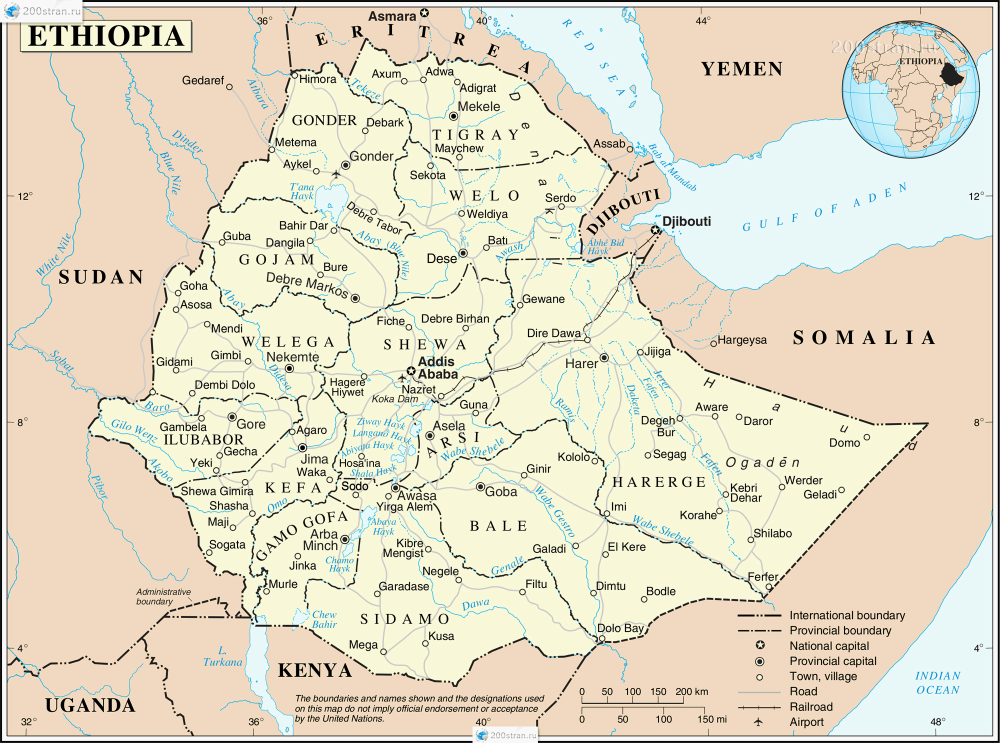
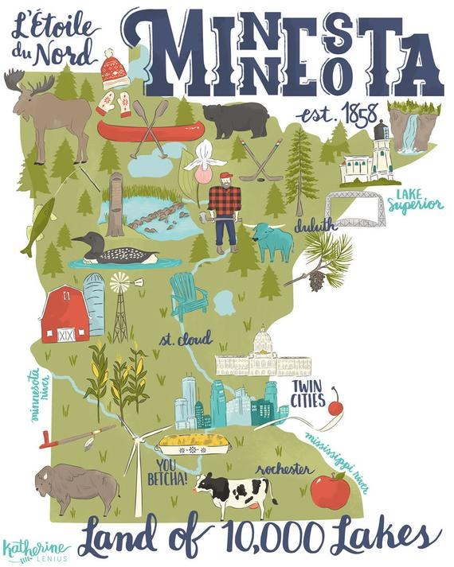

My name is Mahader Tamene
I was born in Ethiopia. 

I lived in three continents by the age of 6.

Oldest of 5 (3 biological, 2 adopted later in life)
I was raised in Minnesota, land of 10,000 lakes. 

People always ask why Minnesota, and oddly enough, 
there's no real answer except that an aunt lived here (product of chain migration -- take that 45!)

I've now made my way to California, via Ethiopia, Germany, Minnesota, Chicago and Boston.  Hoping to use this doctoral degree to advance health and justice in underserved and historically marginalized communities around the globe.  
